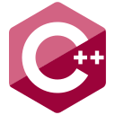
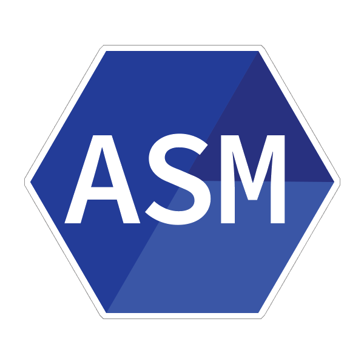
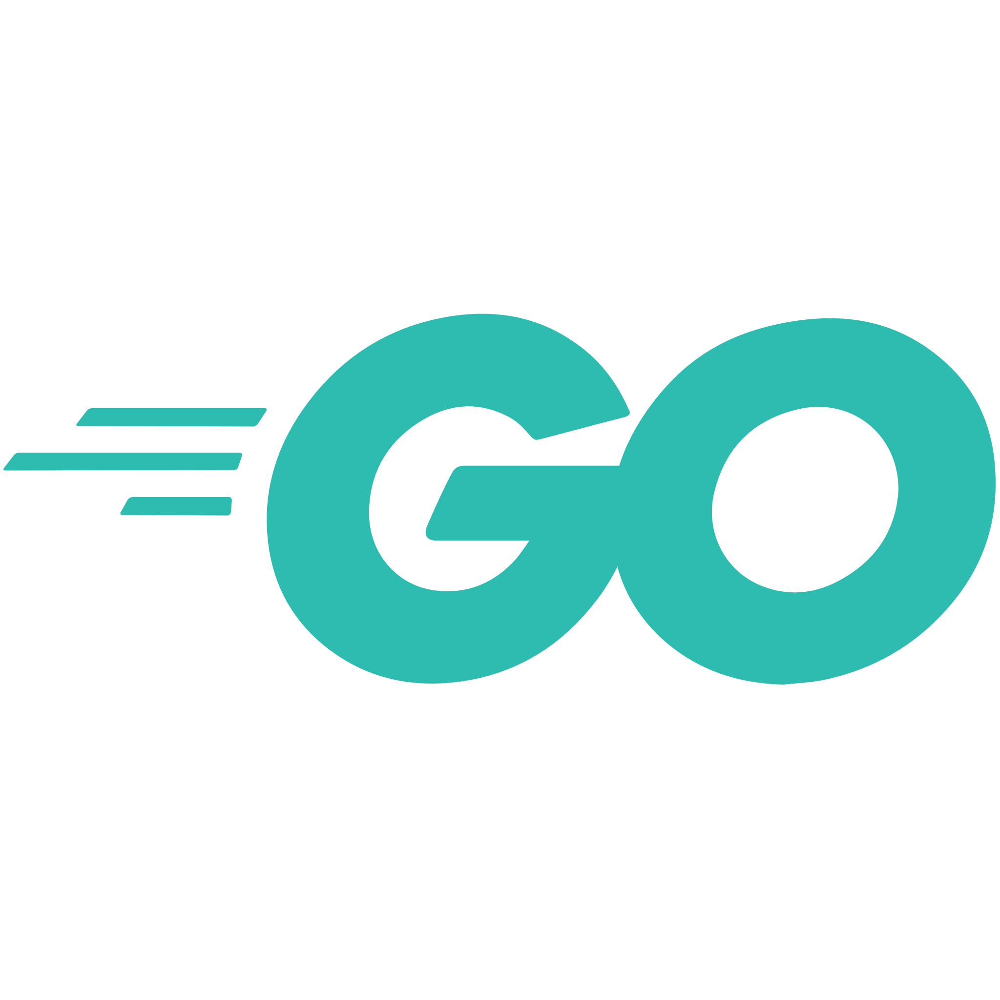
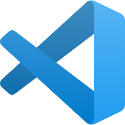
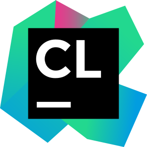

# Hi there 👋

Hey, I'm Faces also known as faceslog.
I'm a student in Software Development living in France. 
*(Most of my repos are now private due to people copy pasting my code and violating license rules.)*

Discord: faceslog#6851 \
Website: [here](https://faceslog.com) \
Github Gist: [here](https://gist.github.com/faceslog)

[//]: # (## Stats 📊)
[//]: # ()

## Languages 📜

- ***Prefer Using*** 😄

  
  
  
  

- ***Learnt a Little*** 😅
  
  
  
  
  
  
- ***IDEs*** 💻 

  
  
  
  
